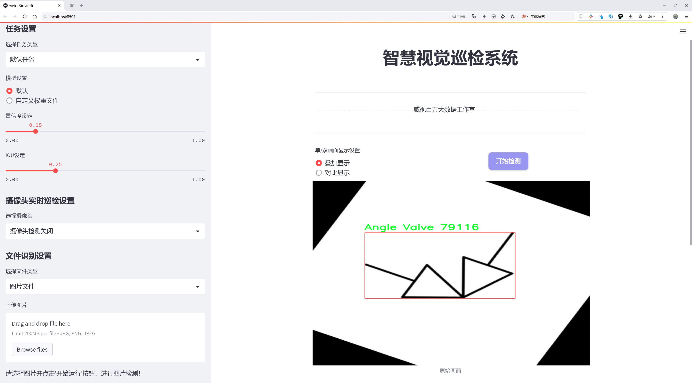
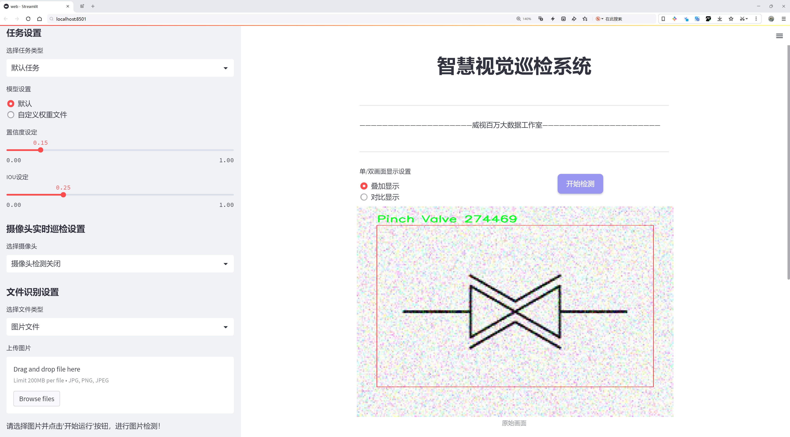
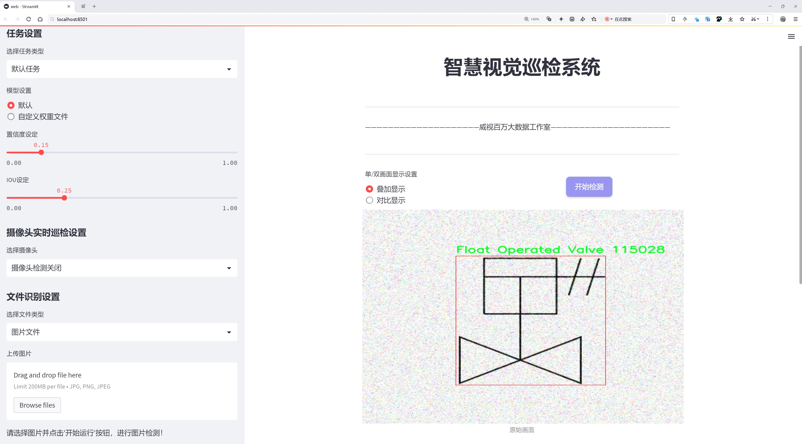
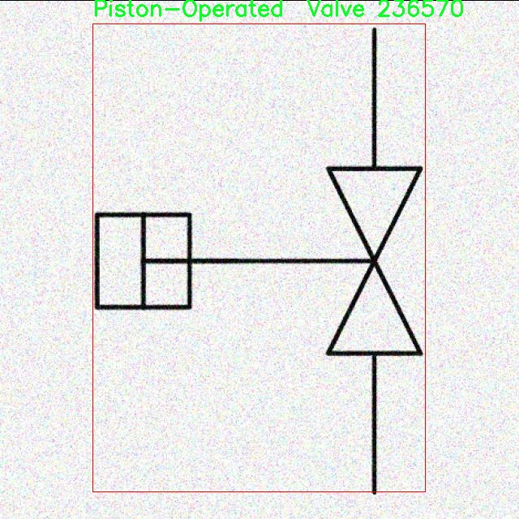
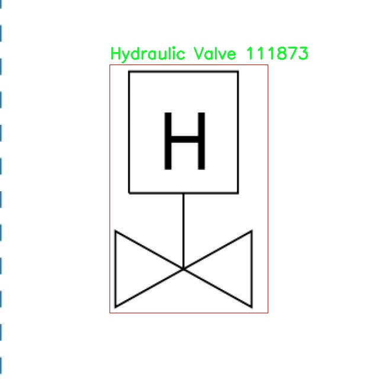
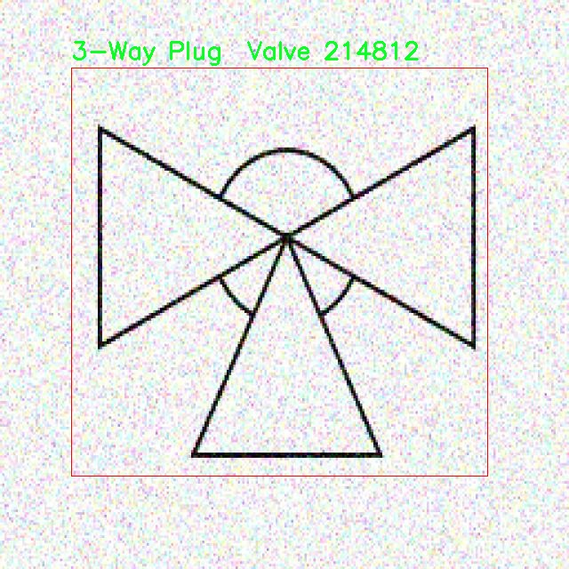
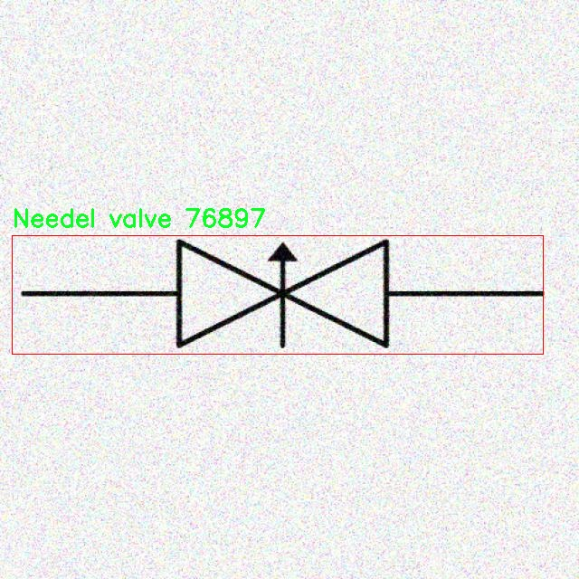
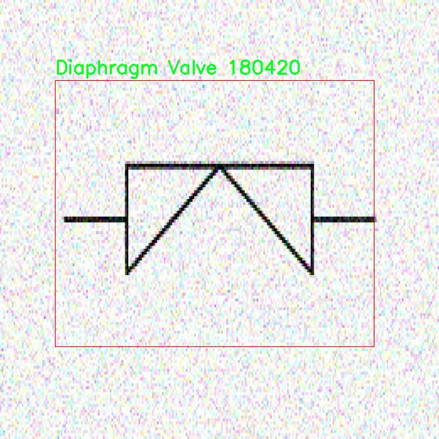

# 阀门类型图检测检测系统源码分享
 # [一条龙教学YOLOV8标注好的数据集一键训练_70+全套改进创新点发刊_Web前端展示]

### 1.研究背景与意义

项目参考[AAAI Association for the Advancement of Artificial Intelligence](https://gitee.com/qunmasj/projects)

项目来源[AACV Association for the Advancement of Computer Vision](https://kdocs.cn/l/cszuIiCKVNis)

研究背景与意义

在现代工业自动化和智能制造的背景下，阀门作为流体控制系统中的关键组件，其类型和状态的准确识别对于系统的安全、效率和维护至关重要。随着工业4.0的推进，智能化设备和系统的普及，传统的人工检测方法逐渐暴露出效率低、成本高、易出错等缺陷。因此，基于计算机视觉的自动化检测系统应运而生，成为提升阀门检测效率和准确性的重要手段。

YOLO（You Only Look Once）系列模型因其高效的实时目标检测能力而受到广泛关注。YOLOv8作为该系列的最新版本，结合了深度学习和计算机视觉的前沿技术，具备更高的检测精度和速度，能够在复杂环境中实现多目标的实时检测。针对阀门类型的检测，YOLOv8的应用具有重要的理论和实践意义。通过改进YOLOv8模型，能够更好地适应阀门图像的特征，提升不同类型阀门的识别率，进而为工业生产提供更加可靠的技术支持。

本研究基于P and ID AI模块提供的1800张阀门图像数据集，涵盖了35种不同类型的阀门，包括3-way valve、4-way valve、ball valve等多种常见阀门。这些图像数据不仅数量丰富，而且类别多样，能够为模型的训练和验证提供坚实的基础。通过对这些数据的深入分析和处理，能够有效提升模型的泛化能力和识别精度。此外，数据集中包含的多种阀门类型和不同的拍摄角度，能够帮助模型学习到更加全面的特征，从而在实际应用中表现出更强的适应性。

研究的意义不仅体现在技术层面，更在于其对工业实践的推动作用。通过建立基于改进YOLOv8的阀门类型图检测系统，可以大幅度提高阀门检测的自动化水平，降低人工成本，减少人为错误，提高检测效率。同时，该系统的成功应用将为其他工业设备的自动检测提供借鉴，推动智能检测技术在更广泛领域的应用。

此外，随着数据科学和人工智能技术的不断发展，基于深度学习的目标检测技术也在不断演进。通过对YOLOv8模型的改进和优化，能够为后续的研究提供新的思路和方法，推动目标检测领域的学术研究进展。总之，本研究不仅具有重要的理论价值，也为实际工业应用提供了切实可行的解决方案，具有广泛的社会和经济意义。

### 2.图片演示







##### 注意：由于此博客编辑较早，上面“2.图片演示”和“3.视频演示”展示的系统图片或者视频可能为老版本，新版本在老版本的基础上升级如下：（实际效果以升级的新版本为准）

  （1）适配了YOLOV8的“目标检测”模型和“实例分割”模型，通过加载相应的权重（.pt）文件即可自适应加载模型。

  （2）支持“图片识别”、“视频识别”、“摄像头实时识别”三种识别模式。

  （3）支持“图片识别”、“视频识别”、“摄像头实时识别”三种识别结果保存导出，解决手动导出（容易卡顿出现爆内存）存在的问题，识别完自动保存结果并导出到tempDir中。

  （4）支持Web前端系统中的标题、背景图等自定义修改，后面提供修改教程。

  另外本项目提供训练的数据集和训练教程,暂不提供权重文件（best.pt）,需要您按照教程进行训练后实现图片演示和Web前端界面演示的效果。

### 3.视频演示

[3.1 视频演示](https://www.bilibili.com/video/BV1R1sSeQEVY/)

### 4.数据集信息展示

##### 4.1 本项目数据集详细数据（类别数＆类别名）

nc: 35
names: ['3-Way Plug  Valve', '3-Way Valve', '3-Way Valve 2', '4 way Valve', '4-way Plug  Valve', 'Angle Valve', 'Angle Valve Hand Operated', 'Back Pressure Regulator', 'Ball Valve NO', 'Butterfly Valve', 'Check Valve', 'Closed gate valve', 'Control Valve', 'Diaphragm Valve', 'Flange Valve 2', 'Float Operated Valve', 'Gate Valve', 'Globe Valve', 'Hydraulic Valve', 'Motor Operator Valve', 'Needel valve', 'Orifice', 'Pilot Gate Valve', 'Pinch Valve', 'Piston-Operated  Valve', 'Plug Valve', 'Plug or Cock  Valve', 'Powered Valve', 'Rotary Valve', 'Self Draining Valve', 'Slide Valve', 'Solenoid Valve', 'Spring Gate Valve', 'Water Flow Meter', 'Weight Gate Valve']


##### 4.2 本项目数据集信息介绍

数据集信息展示

在现代工业自动化和智能制造的背景下，阀门类型的准确识别与分类显得尤为重要。为此，我们构建了一个名为“P and ID AI”的数据集，旨在为改进YOLOv8的阀门类型图检测系统提供丰富的训练数据。该数据集包含35个不同的阀门类别，涵盖了广泛的工业应用场景，确保了模型在多样化环境中的有效性和鲁棒性。

“P and ID AI”数据集的类别列表包括：3-Way Plug Valve、3-Way Valve、3-Way Valve 2、4 way Valve、4-way Plug Valve、Angle Valve、Angle Valve Hand Operated、Back Pressure Regulator、Ball Valve NO、Butterfly Valve、Check Valve、Closed gate valve、Control Valve、Diaphragm Valve、Flange Valve 2、Float Operated Valve、Gate Valve、Globe Valve、Hydraulic Valve、Motor Operator Valve、Needle valve、Orifice、Pilot Gate Valve、Pinch Valve、Piston-Operated Valve、Plug Valve、Plug or Cock Valve、Powered Valve、Rotary Valve、Self Draining Valve、Slide Valve、Solenoid Valve、Spring Gate Valve、Water Flow Meter、Weight Gate Valve。这些类别不仅反映了阀门的多样性，还涵盖了不同的工作原理和应用场景，适用于液体、气体及其他介质的控制。

数据集中的每个类别都经过精心标注，确保了图像的准确性和可靠性。每一张图像都配有详细的元数据，包括阀门的类型、工作状态、安装位置等信息。这些信息对于训练深度学习模型至关重要，能够帮助模型更好地理解和识别不同类型的阀门。此外，数据集中的图像涵盖了不同的拍摄角度、光照条件和背景环境，增强了模型的泛化能力，使其能够在实际应用中更好地适应各种复杂情况。

在数据集的构建过程中，我们还特别关注了数据的多样性和代表性。通过收集来自不同工业领域的阀门图像，我们确保了数据集的广泛适用性。这种多样性不仅提高了模型的识别精度，也使其在面对不同类型的阀门时能够保持较高的准确性和稳定性。

“P and ID AI”数据集的推出，标志着阀门类型图检测技术的一个重要进步。通过利用该数据集进行训练，YOLOv8模型能够在阀门识别任务中实现更高的准确率和更快的检测速度。这将为工业自动化系统的智能化发展提供强有力的支持，推动阀门监测和控制技术的进一步创新。

总之，“P and ID AI”数据集不仅是一个丰富的阀门类型图像库，更是推动阀门检测技术进步的重要工具。随着数据集的不断完善和更新，我们期待它能够为相关领域的研究者和工程师提供更多的灵感和支持，助力工业智能化的未来发展。











### 5.全套项目环境部署视频教程（零基础手把手教学）

[5.1 环境部署教程链接（零基础手把手教学）](https://www.ixigua.com/7404473917358506534?logTag=c807d0cbc21c0ef59de5)


[5.2 安装Python虚拟环境创建和依赖库安装视频教程链接（零基础手把手教学）](https://www.ixigua.com/7404474678003106304?logTag=1f1041108cd1f708b01a)

### 6.手把手YOLOV8训练视频教程（零基础小白有手就能学会）

[6.1 手把手YOLOV8训练视频教程（零基础小白有手就能学会）](https://www.ixigua.com/7404477157818401292?logTag=d31a2dfd1983c9668658)

### 7.70+种全套YOLOV8创新点代码加载调参视频教程（一键加载写好的改进模型的配置文件）

[7.1 70+种全套YOLOV8创新点代码加载调参视频教程（一键加载写好的改进模型的配置文件）](https://www.ixigua.com/7404478314661806627?logTag=29066f8288e3f4eea3a4)

### 8.70+种全套YOLOV8创新点原理讲解（非科班也可以轻松写刊发刊，V10版本正在科研待更新）

由于篇幅限制，每个创新点的具体原理讲解就不一一展开，具体见下列网址中的创新点对应子项目的技术原理博客网址【Blog】：


[8.1 70+种全套YOLOV8创新点原理讲解链接](https://gitee.com/qunmasj/good)

### 9.系统功能展示（检测对象为举例，实际内容以本项目数据集为准）

图9.1.系统支持检测结果表格显示

  图9.2.系统支持置信度和IOU阈值手动调节

  图9.3.系统支持自定义加载权重文件best.pt(需要你通过步骤5中训练获得)

  图9.4.系统支持摄像头实时识别

  图9.5.系统支持图片识别

  图9.6.系统支持视频识别

  图9.7.系统支持识别结果文件自动保存

  图9.8.系统支持Excel导出检测结果数据


### 10.原始YOLOV8算法原理

原始YOLOV8算法原理

YOLOv8是由Ultralytics公司于2023年发布的最新目标检测算法，作为YOLO系列的又一重要进展，YOLOv8在性能和效率上都做出了显著提升。其设计理念继承了YOLO系列的优良传统，同时融合了近年来在计算机视觉领域涌现出的多种创新技术，尤其是YOLOX、YOLOv6、YOLOv7和PP-YOLOE等算法的精华，形成了一种更加高效、准确的目标检测方案。

在YOLOv8的架构中，最引人注目的变化是引入了C2f模块，取代了YOLOv5中的C3模块。这一创新不仅优化了特征提取的过程，还提升了模型的计算效率。C2f模块通过将特征提取分为两个部分来实现，分别进行卷积和连接操作，这种设计有效地增强了模型对特征的表达能力，同时减少了计算量。CSP（Cross Stage Partial）结构的应用，使得网络在保持高效性的同时，能够更好地捕捉图像中的细节信息。

YOLOv8n的主干网络采用了CSP结构，这一结构通过将特征图分为两部分，分别进行卷积和连接，能够有效地减轻梯度消失的问题，提升模型的训练稳定性和收敛速度。此外，YOLOv8在网络的末尾引入了SPPF（Spatial Pyramid Pooling Fast）模块，进一步提高了模型的计算速度和特征提取能力。SPPF模块通过多尺度特征的聚合，使得模型在处理不同大小的目标时，能够更好地适应变化，增强了目标检测的鲁棒性。

在特征融合方面，YOLOv8采用了PAN-FPN（Path Aggregation Network - Feature Pyramid Network）结构，这一结构通过多尺度特征的融合，能够有效地提高模型对不同尺度目标的检测能力。PAN-FPN通过将低层特征与高层特征进行融合，确保了模型在检测小目标时的准确性，同时也提升了对大目标的检测性能。这种多尺度特征融合的策略，使得YOLOv8在复杂场景下的表现更加出色。

YOLOv8在检测网络中采用了Anchor-Free的检测方式，这一设计理念的核心在于减少了对预定义锚框的依赖，使得模型在处理目标时更加灵活。传统的锚框方法往往需要手动调整锚框的大小和比例，而YOLOv8通过解耦头结构，能够自适应地生成目标的边界框，从而提高了检测的精度和效率。解耦头结构的引入，使得模型在处理不同类别的目标时，能够更加准确地预测目标的位置和类别，进一步提升了检测性能。

在损失函数的设计上，YOLOv8采用了CloU（Class-wise Localization Uncertainty）损失函数，这一损失函数的引入，旨在提高模型对目标位置和类别的预测准确性。CloU损失函数通过考虑目标的定位不确定性，使得模型在训练过程中能够更好地学习到目标的特征，从而在实际应用中表现出更高的精度。

YOLOv8的整体设计理念是将高精度与高速度相结合，致力于在实时检测领域达到新的高度。其在特征提取、特征融合、检测方式以及损失函数等多个方面的创新，使得YOLOv8在目标检测任务中展现出了卓越的性能。这一系列的改进不仅使得YOLOv8在标准数据集上的表现优于前代模型，也为实际应用提供了强有力的支持。

在实际应用中，YOLOv8的高效性和准确性使其成为了自动化领域的理想选择。例如，在苹果采摘的场景中，YOLOv8能够快速识别和定位苹果，极大地提高了自动采摘机器人的工作效率。结合蚁群算法进行路径规划，能够进一步优化采摘过程，使得机器人在复杂环境中能够高效、准确地完成任务。

综上所述，YOLOv8作为一款先进的目标检测算法，其原理和设计理念不仅继承了YOLO系列的优良传统，还通过多项创新技术的融合，达到了实时检测的新高度。无论是在学术研究还是实际应用中，YOLOv8都展现出了强大的潜力和广泛的应用前景。


### 11.项目核心源码讲解（再也不用担心看不懂代码逻辑）

#### 11.1 ui.py

以下是经过简化和注释的核心代码部分：

```python
import sys
import subprocess
from QtFusion.path import abs_path

def run_script(script_path):
    """
    使用当前 Python 环境运行指定的脚本。

    Args:
        script_path (str): 要运行的脚本路径
    """
    # 获取当前 Python 解释器的路径
    python_path = sys.executable

    # 构建运行命令，使用 streamlit 运行指定的脚本
    command = f'"{python_path}" -m streamlit run "{script_path}"'

    # 执行命令，并等待其完成
    result = subprocess.run(command, shell=True)
    
    # 检查命令执行结果，如果返回码不为0，则表示出错
    if result.returncode != 0:
        print("脚本运行出错。")

# 主程序入口
if __name__ == "__main__":
    # 获取脚本的绝对路径
    script_path = abs_path("web.py")

    # 运行指定的脚本
    run_script(script_path)
```

### 代码说明：
1. **导入模块**：
   - `sys`：用于获取当前 Python 解释器的路径。
   - `subprocess`：用于执行外部命令。
   - `abs_path`：从 `QtFusion.path` 模块导入，用于获取文件的绝对路径。

2. **`run_script` 函数**：
   - 该函数接受一个脚本路径作为参数，并使用当前 Python 环境运行该脚本。
   - 使用 `sys.executable` 获取当前 Python 解释器的路径。
   - 构建一个命令字符串，使用 `streamlit` 运行指定的脚本。
   - 使用 `subprocess.run` 执行命令，并检查返回码以判断脚本是否成功运行。

3. **主程序入口**：
   - 当脚本作为主程序运行时，获取 `web.py` 的绝对路径，并调用 `run_script` 函数执行该脚本。

这个文件名为 `ui.py`，它的主要功能是运行一个指定的 Python 脚本，具体来说是使用 Streamlit 框架来启动一个 Web 应用。

首先，文件中导入了一些必要的模块，包括 `sys`、`os` 和 `subprocess`。其中，`sys` 模块用于访问与 Python 解释器相关的变量和函数，`os` 模块提供了与操作系统交互的功能，而 `subprocess` 模块则用于执行外部命令。

接下来，文件中定义了一个名为 `run_script` 的函数。这个函数接受一个参数 `script_path`，它是要运行的脚本的路径。函数内部首先获取当前 Python 解释器的路径，存储在 `python_path` 变量中。然后，构建一个命令字符串，使用 Streamlit 来运行指定的脚本。这个命令的格式是 `"{python_path}" -m streamlit run "{script_path}"`，其中 `-m` 选项表示以模块的方式运行 Streamlit。

之后，使用 `subprocess.run` 方法来执行这个命令。该方法的 `shell=True` 参数允许在 shell 中执行命令。执行完命令后，函数检查返回的结果码，如果不为零，表示脚本运行出错，程序会打印出“脚本运行出错。”的提示信息。

在文件的最后部分，使用 `if __name__ == "__main__":` 语句来确保只有在直接运行该脚本时才会执行以下代码。这里指定了要运行的脚本路径，调用 `abs_path` 函数获取 `web.py` 的绝对路径，并将其传递给 `run_script` 函数以启动应用。

总体而言，这个 `ui.py` 文件的作用是作为一个启动器，方便用户在当前 Python 环境中运行一个基于 Streamlit 的 Web 应用。

#### 11.2 70+种YOLOv8算法改进源码大全和调试加载训练教程（非必要）\ultralytics\utils\torch_utils.py

以下是代码中最核心的部分，并附上详细的中文注释：

```python
import torch
import torch.nn as nn
import torch.nn.functional as F

def select_device(device='', batch=0, newline=False, verbose=True):
    """
    根据提供的参数选择合适的PyTorch设备。

    该函数接受一个字符串指定设备或torch.device对象，并返回一个torch.device对象
    表示所选设备。该函数还验证可用设备的数量，如果请求的设备不可用，则引发异常。

    参数:
        device (str | torch.device, optional): 设备字符串或torch.device对象。
            选项包括'None'、'cpu'或'cuda'，或'0'或'0,1,2,3'。默认为空字符串，自动选择
            第一个可用的GPU，或如果没有可用的GPU则选择CPU。
        batch (int, optional): 模型使用的批量大小。默认为0。
        newline (bool, optional): 如果为True，则在日志字符串末尾添加换行符。默认为False。
        verbose (bool, optional): 如果为True，则记录设备信息。默认为True。

    返回:
        (torch.device): 选择的设备。

    引发:
        ValueError: 如果指定的设备不可用，或者在使用多个GPU时批量大小不是设备数量的倍数。

    示例:
        >>> select_device('cuda:0')
        device(type='cuda', index=0)

        >>> select_device('cpu')
        device(type='cpu')
    """
    if isinstance(device, torch.device):
        return device

    device = str(device).lower()
    cpu = device == 'cpu'
    if cpu:
        os.environ['CUDA_VISIBLE_DEVICES'] = '-1'  # 强制torch.cuda.is_available() = False
    elif device:  # 请求非CPU设备
        if device == 'cuda':
            device = '0'
        os.environ['CUDA_VISIBLE_DEVICES'] = device  # 设置环境变量
        if not (torch.cuda.is_available() and torch.cuda.device_count() >= len(device.replace(',', ''))):
            raise ValueError(f"无效的CUDA设备请求: {device}.")

    if not cpu and torch.cuda.is_available():  # 优先使用可用的GPU
        devices = device.split(',') if device else '0'
        n = len(devices)  # 设备数量
        if n > 1 and batch > 0 and batch % n != 0:  # 检查批量大小是否可被设备数量整除
            raise ValueError(f"'batch={batch}' 必须是GPU数量 {n} 的倍数.")
        arg = 'cuda:0'
    else:  # 回退到CPU
        arg = 'cpu'

    return torch.device(arg)

def fuse_conv_and_bn(conv, bn):
    """融合Conv2d()和BatchNorm2d()层。"""
    fusedconv = nn.Conv2d(conv.in_channels,
                          conv.out_channels,
                          kernel_size=conv.kernel_size,
                          stride=conv.stride,
                          padding=conv.padding,
                          dilation=conv.dilation,
                          groups=conv.groups,
                          bias=True).requires_grad_(False).to(conv.weight.device)

    # 准备卷积权重
    w_conv = conv.weight.clone().view(conv.out_channels, -1)
    w_bn = torch.diag(bn.weight.div(torch.sqrt(bn.eps + bn.running_var)))
    fusedconv.weight.copy_(torch.mm(w_bn, w_conv).view(fusedconv.weight.shape))

    # 准备偏置
    b_conv = torch.zeros(conv.weight.size(0), device=conv.weight.device) if conv.bias is None else conv.bias
    b_bn = bn.bias - bn.weight.mul(bn.running_mean).div(torch.sqrt(bn.running_var + bn.eps))
    fusedconv.bias.copy_(torch.mm(w_bn, b_conv.reshape(-1, 1)).reshape(-1) + b_bn)

    return fusedconv

def model_info(model, detailed=False, verbose=True, imgsz=640):
    """
    输出模型信息。

    imgsz可以是int或list，例如imgsz=640或imgsz=[640, 320]。
    """
    if not verbose:
        return
    n_p = get_num_params(model)  # 参数数量
    n_g = get_num_gradients(model)  # 梯度数量
    n_l = len(list(model.modules()))  # 层数量
    if detailed:
        for i, (name, p) in enumerate(model.named_parameters()):
            name = name.replace('module_list.', '')
            print(f'{i} {name} {p.requires_grad} {p.numel()} {list(p.shape)}')

    flops = get_flops(model, imgsz)  # 计算FLOPs
    print(f'模型摘要: {n_l} 层, {n_p} 参数, {n_g} 梯度, {flops:.1f} GFLOPs')
    return n_l, n_p, n_g, flops

def get_num_params(model):
    """返回YOLO模型中的参数总数。"""
    return sum(x.numel() for x in model.parameters())

def get_num_gradients(model):
    """返回YOLO模型中具有梯度的参数总数。"""
    return sum(x.numel() for x in model.parameters() if x.requires_grad)

def initialize_weights(model):
    """初始化模型权重为随机值。"""
    for m in model.modules():
        if isinstance(m, nn.Conv2d):
            nn.init.kaiming_normal_(m.weight, mode='fan_out', nonlinearity='relu')
        elif isinstance(m, nn.BatchNorm2d):
            m.eps = 1e-3
            m.momentum = 0.03

def time_sync():
    """返回PyTorch准确的时间。"""
    if torch.cuda.is_available():
        torch.cuda.synchronize()
    return time.time()
```

### 代码核心部分说明：
1. **选择设备** (`select_device`): 该函数用于选择适合的计算设备（CPU或GPU），并确保设备可用。
2. **融合卷积和批归一化层** (`fuse_conv_and_bn`): 该函数将卷积层和批归一化层融合为一个层，以提高推理速度。
3. **模型信息输出** (`model_info`): 输出模型的参数数量、梯度数量、层数量及FLOPs（每秒浮点运算次数）。
4. **参数和梯度数量获取** (`get_num_params` 和 `get_num_gradients`): 这两个函数分别用于获取模型的参数总数和具有梯度的参数总数。
5. **初始化权重** (`initialize_weights`): 该函数用于初始化模型的权重，使用Kaiming正态分布初始化卷积层的权重。
6. **时间同步** (`time_sync`): 该函数用于确保在CUDA设备上同步时间，以获得准确的时间测量。

这个程序文件是Ultralytics YOLOv8算法的一个工具模块，主要用于处理与PyTorch相关的功能，包括设备选择、模型信息获取、模型参数和梯度统计、图像处理、模型权重初始化等。文件中包含了多个函数和类，每个函数和类都有其特定的功能。

首先，文件导入了一些必要的库，包括数学计算、操作系统、随机数生成、时间处理、上下文管理、深拷贝、路径处理以及类型提示等。还导入了NumPy和PyTorch的相关模块，特别是与分布式训练和神经网络相关的模块。

文件中定义了一个上下文管理器`torch_distributed_zero_first`，用于在分布式训练中协调各个进程的操作。接着，定义了`sma_inference_mode`函数，根据PyTorch的版本选择合适的推理模式，以提高推理效率。

`select_device`函数用于选择合适的PyTorch设备（CPU或GPU），并根据输入的设备字符串进行验证，确保所请求的设备可用。如果请求的设备不可用，则会抛出异常。该函数还会设置环境变量`CUDA_VISIBLE_DEVICES`，以指定使用的GPU。

`time_sync`函数用于同步CUDA时间，确保在使用GPU时，时间测量的准确性。`fuse_conv_and_bn`和`fuse_deconv_and_bn`函数用于将卷积层和批归一化层融合，以提高模型的推理速度。

`model_info`函数用于获取模型的信息，包括参数数量、梯度数量和层数等。它还可以输出详细的模型参数信息。`get_num_params`和`get_num_gradients`函数分别用于计算模型的总参数数量和具有梯度的参数数量。

`initialize_weights`函数用于初始化模型的权重，确保模型在训练开始时具有合适的初始值。`scale_img`函数用于根据给定的比例和网格大小对图像进行缩放和填充，以适应模型的输入要求。

文件中还定义了一些实用的工具函数，如`make_divisible`用于确保数值可以被指定的除数整除，`copy_attr`用于复制对象的属性，`get_latest_opset`用于获取最新支持的ONNX操作集，`intersect_dicts`用于获取两个字典中交集的键值对。

`ModelEMA`类用于实现模型的指数移动平均（EMA），以提高模型的稳定性和性能。`strip_optimizer`函数用于从训练好的模型中去除优化器信息，以便于模型的部署和推理。

最后，文件中还定义了`profile`函数，用于对模型进行速度、内存和FLOPs的分析，以及`EarlyStopping`类用于实现早停机制，以便在训练过程中监控模型的性能并在没有改进时提前停止训练。

总体来说，这个文件提供了YOLOv8模型训练和推理过程中所需的多种工具和功能，帮助用户更高效地使用和优化模型。

#### 11.3 70+种YOLOv8算法改进源码大全和调试加载训练教程（非必要）\ultralytics\hub\__init__.py

以下是代码中最核心的部分，并附上详细的中文注释：

```python
import requests  # 导入requests库，用于发送HTTP请求

from ultralytics.hub.auth import Auth  # 导入身份验证模块
from ultralytics.utils import LOGGER, SETTINGS  # 导入日志记录和设置模块

def login(api_key=''):
    """
    使用提供的API密钥登录Ultralytics HUB API。

    参数:
        api_key (str, optional): API密钥或API密钥与模型ID的组合，例如key_id

    示例:
        ```python
        from ultralytics import hub

        hub.login('API_KEY')
        ```
    """
    Auth(api_key, verbose=True)  # 调用Auth类进行身份验证

def logout():
    """
    从Ultralytics HUB注销，通过从设置文件中移除API密钥。要再次登录，请使用'yolo hub login'。

    示例:
        ```python
        from ultralytics import hub

        hub.logout()
        ```
    """
    SETTINGS['api_key'] = ''  # 清空API密钥
    SETTINGS.save()  # 保存设置
    LOGGER.info(f"已注销 ✅. 要再次登录，请使用 'yolo hub login'。")  # 记录注销信息

def export_model(model_id='', format='torchscript'):
    """将模型导出为所有支持的格式。"""
    # 检查导出格式是否有效
    assert format in export_fmts_hub(), f"不支持的导出格式 '{format}'，有效格式为 {export_fmts_hub()}"
    
    # 发送POST请求以导出模型
    r = requests.post(f'{HUB_API_ROOT}/v1/models/{model_id}/export',
                      json={'format': format},
                      headers={'x-api-key': Auth().api_key})
    
    # 检查请求是否成功
    assert r.status_code == 200, f'{format} 导出失败 {r.status_code} {r.reason}'
    LOGGER.info(f'{format} 导出已开始 ✅')  # 记录导出开始的信息

def check_dataset(path='', task='detect'):
    """
    在上传之前检查HUB数据集Zip文件的错误。它在上传到HUB之前检查数据集是否存在错误。

    参数:
        path (str, optional): 数据集Zip文件的路径（其中包含data.yaml）。默认为''。
        task (str, optional): 数据集任务。选项包括'detect'、'segment'、'pose'、'classify'。默认为'detect'。

    示例:
        ```python
        from ultralytics.hub import check_dataset

        check_dataset('path/to/coco8.zip', task='detect')  # 检查检测数据集
        ```
    """
    HUBDatasetStats(path=path, task=task).get_json()  # 检查数据集并获取统计信息
    LOGGER.info(f'检查完成 ✅. 将此数据集上传到 {HUB_WEB_ROOT}/datasets/.')  # 记录检查完成的信息
```

### 代码说明：
1. **登录与注销功能**：`login`和`logout`函数用于用户身份验证，分别处理登录和注销操作。
2. **模型导出功能**：`export_model`函数用于将指定的模型导出为特定格式，并进行有效性检查。
3. **数据集检查功能**：`check_dataset`函数用于在上传数据集之前检查其有效性，确保数据集格式正确且无错误。

这个程序文件是Ultralytics YOLO（You Only Look Once）框架的一部分，主要用于与Ultralytics HUB API进行交互。文件中包含了一些用于登录、登出、模型重置、导出模型、检查数据集等功能的函数。

首先，`login`函数允许用户通过提供API密钥来登录Ultralytics HUB API。用户可以选择只提供API密钥，或者同时提供API密钥和模型ID。成功登录后，用户可以访问与HUB相关的功能。

接下来，`logout`函数用于登出Ultralytics HUB。它通过清空设置文件中的API密钥来实现登出，并在日志中记录相关信息，提示用户可以通过特定命令重新登录。

`reset_model`函数用于将已训练的模型重置为未训练状态。它通过向HUB API发送POST请求来实现，如果请求成功，日志中会记录模型重置成功的信息；如果失败，则会记录警告信息。

`export_fmts_hub`函数返回HUB支持的导出格式列表。它从其他模块中导入可用的导出格式，并将其与一些特定格式（如`ultralytics_tflite`和`ultralytics_coreml`）结合在一起返回。

`export_model`函数用于将模型导出为指定格式。用户需要提供模型ID和导出格式，如果格式不被支持，函数会抛出异常。成功导出后，日志中会记录导出开始的信息。

`get_export`函数用于获取已导出的模型的字典，包括下载链接。与`export_model`类似，用户需要提供模型ID和导出格式，并在请求成功后返回导出的模型信息。

最后，`check_dataset`函数用于在上传数据集到HUB之前进行错误检查。它会检查给定路径下的ZIP文件，确保其中包含正确的`data.yaml`文件，并根据任务类型（如检测、分割、姿态估计、分类）进行相应的检查。检查完成后，日志中会记录成功的信息，提示用户可以将数据集上传到指定的HUB网站。

整体来看，这个文件为用户提供了一系列与Ultralytics HUB进行交互的功能，简化了模型管理和数据集上传的流程。

#### 11.4 code\ultralytics\models\sam\amg.py

以下是经过简化并注释的核心代码部分：

```python
import torch
import numpy as np

def is_box_near_crop_edge(
    boxes: torch.Tensor, crop_box: List[int], orig_box: List[int], atol: float = 20.0
) -> torch.Tensor:
    """
    判断给定的边界框是否接近裁剪边缘。

    参数：
    - boxes: 需要检查的边界框，格式为 (x1, y1, x2, y2)。
    - crop_box: 当前裁剪框的边界，格式为 [x0, y0, x1, y1]。
    - orig_box: 原始图像的边界框，格式为 [x0, y0, x1, y1]。
    - atol: 允许的绝对误差，默认为 20.0。

    返回：
    - 一个布尔张量，指示每个框是否接近裁剪边缘。
    """
    # 将裁剪框和原始框转换为张量
    crop_box_torch = torch.as_tensor(crop_box, dtype=torch.float, device=boxes.device)
    orig_box_torch = torch.as_tensor(orig_box, dtype=torch.float, device=boxes.device)
    
    # 将 boxes 从裁剪坐标转换为原始坐标
    boxes = uncrop_boxes_xyxy(boxes, crop_box).float()
    
    # 检查 boxes 是否接近裁剪框和原始框的边缘
    near_crop_edge = torch.isclose(boxes, crop_box_torch[None, :], atol=atol, rtol=0)
    near_image_edge = torch.isclose(boxes, orig_box_torch[None, :], atol=atol, rtol=0)
    
    # 仅保留接近裁剪边缘但不接近原始图像边缘的框
    near_crop_edge = torch.logical_and(near_crop_edge, ~near_image_edge)
    
    # 返回是否有任何框接近裁剪边缘
    return torch.any(near_crop_edge, dim=1)


def uncrop_boxes_xyxy(boxes: torch.Tensor, crop_box: List[int]) -> torch.Tensor:
    """
    将裁剪框的边界框转换为原始图像坐标。

    参数：
    - boxes: 需要转换的边界框，格式为 (x1, y1, x2, y2)。
    - crop_box: 当前裁剪框的边界，格式为 [x0, y0, x1, y1]。

    返回：
    - 转换后的边界框，格式为 (x1, y1, x2, y2)。
    """
    x0, y0, _, _ = crop_box
    # 创建偏移量张量
    offset = torch.tensor([[x0, y0, x0, y0]], device=boxes.device)
    
    # 检查 boxes 是否有通道维度
    if len(boxes.shape) == 3:
        offset = offset.unsqueeze(1)
    
    # 返回添加偏移量后的边界框
    return boxes + offset


def batched_mask_to_box(masks: torch.Tensor) -> torch.Tensor:
    """
    计算给定掩码的边界框，返回格式为 (x1, y1, x2, y2)。

    参数：
    - masks: 输入掩码，格式为 CxHxW。

    返回：
    - 计算得到的边界框，格式为 Cx4。
    """
    # 如果掩码为空，返回全零框
    if torch.numel(masks) == 0:
        return torch.zeros(*masks.shape[:-2], 4, device=masks.device)

    # 规范化形状为 CxHxW
    shape = masks.shape
    h, w = shape[-2:]
    masks = masks.flatten(0, -3) if len(shape) > 2 else masks.unsqueeze(0)
    
    # 计算上下边缘
    in_height, _ = torch.max(masks, dim=-1)
    in_height_coords = in_height * torch.arange(h, device=in_height.device)[None, :]
    bottom_edges, _ = torch.max(in_height_coords, dim=-1)
    in_height_coords = in_height_coords + h * (~in_height)
    top_edges, _ = torch.min(in_height_coords, dim=-1)

    # 计算左右边缘
    in_width, _ = torch.max(masks, dim=-2)
    in_width_coords = in_width * torch.arange(w, device=in_width.device)[None, :]
    right_edges, _ = torch.max(in_width_coords, dim=-1)
    in_width_coords = in_width_coords + w * (~in_width)
    left_edges, _ = torch.min(in_width_coords, dim=-1)

    # 处理空掩码的情况
    empty_filter = (right_edges < left_edges) | (bottom_edges < top_edges)
    out = torch.stack([left_edges, top_edges, right_edges, bottom_edges], dim=-1)
    out = out * (~empty_filter).unsqueeze(-1)

    # 返回到原始形状
    return out.reshape(*shape[:-2], 4) if len(shape) > 2 else out[0]
```

### 代码说明：
1. **is_box_near_crop_edge**: 判断给定的边界框是否接近裁剪边缘。通过将裁剪框和原始框转换为张量，检查每个框是否接近这些边缘，并返回布尔值。

2. **uncrop_boxes_xyxy**: 将裁剪框的边界框转换为原始图像坐标。通过添加裁剪框的偏移量来实现。

3. **batched_mask_to_box**: 计算给定掩码的边界框。处理空掩码的情况，并返回计算得到的边界框。

这个程序文件是一个与计算机视觉相关的模块，主要用于处理图像中的掩膜（mask）和边界框（bounding box），并提供了一些辅助功能。代码使用了PyTorch和NumPy库，包含多个函数，每个函数的功能如下：

首先，`is_box_near_crop_edge`函数用于判断给定的边界框是否接近裁剪边缘。它接收边界框、裁剪框和原始框作为输入，并返回一个布尔张量，指示哪些边界框接近裁剪边缘。通过将边界框转换为裁剪框的坐标系，结合设定的容差值（`atol`），函数可以有效地判断边界框的位置。

接下来的`batch_iterator`函数用于从输入参数中生成批次数据。它确保所有输入参数的长度相同，并根据指定的批次大小生成数据的迭代器。

`calculate_stability_score`函数计算一组掩膜的稳定性分数。稳定性分数是通过计算在高低阈值下的二进制掩膜之间的交并比（IoU）来获得的。这对于评估掩膜的质量非常重要。

`build_point_grid`和`build_all_layer_point_grids`函数用于生成均匀分布的二维点网格。`build_point_grid`生成一个指定大小的点网格，而`build_all_layer_point_grids`则为所有裁剪层生成点网格。

`generate_crop_boxes`函数生成不同大小的裁剪框，适用于多层次的图像处理。它根据图像的尺寸、层数和重叠比例计算裁剪框的位置和大小。

`uncrop_boxes_xyxy`、`uncrop_points`和`uncrop_masks`函数用于将裁剪的边界框、点和掩膜转换回原始图像的坐标系。这些函数通过添加裁剪框的偏移量来实现坐标的转换。

`remove_small_regions`函数用于移除掩膜中的小区域或孔洞。它使用OpenCV库中的连通组件分析方法，返回处理后的掩膜和一个指示是否进行了修改的布尔值。

最后，`batched_mask_to_box`函数计算掩膜周围的边界框，返回以XYXY格式表示的边界框。如果掩膜为空，则返回[0, 0, 0, 0]。该函数支持多维输入，并将结果返回到原始形状。

总体而言，这个模块提供了一系列用于图像处理和分析的工具，特别是在目标检测和分割任务中非常有用。通过这些函数，用户可以有效地处理图像中的掩膜和边界框，进行后续的分析和计算。

#### 11.5 train.py

以下是经过简化和注释的核心代码部分，主要集中在YOLO模型的训练和数据处理上：

```python
import random
import numpy as np
import torch.nn as nn
from ultralytics.data import build_dataloader, build_yolo_dataset
from ultralytics.engine.trainer import BaseTrainer
from ultralytics.models import yolo
from ultralytics.nn.tasks import DetectionModel
from ultralytics.utils import LOGGER, RANK
from ultralytics.utils.torch_utils import de_parallel, torch_distributed_zero_first

class DetectionTrainer(BaseTrainer):
    """
    扩展自BaseTrainer类，用于基于检测模型的训练。
    """

    def build_dataset(self, img_path, mode="train", batch=None):
        """
        构建YOLO数据集。

        参数:
            img_path (str): 包含图像的文件夹路径。
            mode (str): 模式为`train`或`val`，用户可以为每种模式自定义不同的增强。
            batch (int, optional): 批次大小，适用于`rect`模式。默认为None。
        """
        gs = max(int(de_parallel(self.model).stride.max() if self.model else 0), 32)  # 获取模型的最大步幅
        return build_yolo_dataset(self.args, img_path, batch, self.data, mode=mode, rect=mode == "val", stride=gs)

    def get_dataloader(self, dataset_path, batch_size=16, rank=0, mode="train"):
        """构造并返回数据加载器。"""
        assert mode in ["train", "val"]  # 确保模式有效
        with torch_distributed_zero_first(rank):  # 仅在DDP中初始化数据集
            dataset = self.build_dataset(dataset_path, mode, batch_size)  # 构建数据集
        shuffle = mode == "train"  # 训练模式下打乱数据
        workers = self.args.workers if mode == "train" else self.args.workers * 2  # 根据模式设置工作线程数
        return build_dataloader(dataset, batch_size, workers, shuffle, rank)  # 返回数据加载器

    def preprocess_batch(self, batch):
        """对图像批次进行预处理，包括缩放和转换为浮点数。"""
        batch["img"] = batch["img"].to(self.device, non_blocking=True).float() / 255  # 将图像转换为浮点数并归一化
        if self.args.multi_scale:  # 如果启用多尺度
            imgs = batch["img"]
            sz = (
                random.randrange(self.args.imgsz * 0.5, self.args.imgsz * 1.5 + self.stride)
                // self.stride
                * self.stride
            )  # 随机选择一个尺寸
            sf = sz / max(imgs.shape[2:])  # 计算缩放因子
            if sf != 1:  # 如果需要缩放
                ns = [
                    math.ceil(x * sf / self.stride) * self.stride for x in imgs.shape[2:]
                ]  # 计算新的形状
                imgs = nn.functional.interpolate(imgs, size=ns, mode="bilinear", align_corners=False)  # 进行插值缩放
            batch["img"] = imgs  # 更新批次图像
        return batch

    def get_model(self, cfg=None, weights=None, verbose=True):
        """返回YOLO检测模型。"""
        model = DetectionModel(cfg, nc=self.data["nc"], verbose=verbose and RANK == -1)  # 创建检测模型
        if weights:
            model.load(weights)  # 加载权重
        return model

    def plot_training_samples(self, batch, ni):
        """绘制带有注释的训练样本。"""
        plot_images(
            images=batch["img"],
            batch_idx=batch["batch_idx"],
            cls=batch["cls"].squeeze(-1),
            bboxes=batch["bboxes"],
            paths=batch["im_file"],
            fname=self.save_dir / f"train_batch{ni}.jpg",
            on_plot=self.on_plot,
        )

    def plot_metrics(self):
        """从CSV文件绘制指标。"""
        plot_results(file=self.csv, on_plot=self.on_plot)  # 保存结果图像
```

### 代码说明：
1. **DetectionTrainer类**：继承自`BaseTrainer`，用于YOLO模型的训练。
2. **build_dataset方法**：根据给定的图像路径和模式构建YOLO数据集。
3. **get_dataloader方法**：构造数据加载器，支持分布式训练。
4. **preprocess_batch方法**：对输入的图像批次进行预处理，包括归一化和多尺度调整。
5. **get_model方法**：返回YOLO检测模型，并可选择加载预训练权重。
6. **plot_training_samples和plot_metrics方法**：用于可视化训练样本和训练过程中的指标。

这个程序文件 `train.py` 是一个用于训练 YOLO（You Only Look Once）目标检测模型的实现，基于 Ultralytics 的框架。程序的核心是 `DetectionTrainer` 类，它继承自 `BaseTrainer` 类，专门用于处理目标检测任务。

在文件开头，导入了一些必要的库和模块，包括数学运算、随机数生成、深度学习相关的库（如 PyTorch）以及 Ultralytics 提供的各种工具和函数。这些导入为后续的模型训练和数据处理提供了支持。

`DetectionTrainer` 类中定义了多个方法。首先，`build_dataset` 方法用于构建 YOLO 数据集，接受图像路径、模式（训练或验证）和批次大小作为参数。它利用 `build_yolo_dataset` 函数来生成数据集，并根据模型的步幅（stride）进行适当的调整。

接下来，`get_dataloader` 方法用于创建数据加载器。它根据传入的模式（训练或验证）来构建数据集，并设置数据加载的参数，比如是否打乱数据（shuffle）和工作线程的数量。这个方法确保在分布式训练中，数据集只初始化一次。

`preprocess_batch` 方法负责对输入的图像批次进行预处理，包括将图像缩放到适当的大小并转换为浮点数格式。它还支持多尺度训练，即在训练过程中随机选择不同的图像尺寸。

`set_model_attributes` 方法用于设置模型的属性，包括类别数量和类别名称等，以确保模型能够正确处理特定的数据集。

`get_model` 方法返回一个 YOLO 检测模型，并可选择加载预训练权重。`get_validator` 方法则返回一个用于模型验证的 `DetectionValidator` 实例，负责评估模型在验证集上的表现。

`label_loss_items` 方法用于返回带有标签的训练损失项字典，方便在训练过程中跟踪损失情况。`progress_string` 方法返回一个格式化的字符串，显示训练进度，包括当前的 epoch、GPU 内存使用情况、损失值、实例数量和图像大小等信息。

`plot_training_samples` 方法用于绘制训练样本及其标注，便于可视化训练数据的质量。`plot_metrics` 方法则从 CSV 文件中绘制训练过程中的指标，生成结果图。最后，`plot_training_labels` 方法创建一个带标签的训练图，显示训练集中所有的边界框和类别信息。

整体来看，这个文件实现了 YOLO 模型的训练过程，包括数据加载、预处理、模型构建、训练监控和结果可视化等功能，为用户提供了一个完整的目标检测训练框架。

#### 11.6 code\ultralytics\engine\validator.py

以下是代码中最核心的部分，并附上详细的中文注释：

```python
class BaseValidator:
    """
    BaseValidator类用于创建验证器的基类。

    属性:
        args (SimpleNamespace): 验证器的配置。
        dataloader (DataLoader): 用于验证的数据加载器。
        model (nn.Module): 要验证的模型。
        device (torch.device): 用于验证的设备。
        speed (dict): 包含预处理、推理、损失和后处理的速度信息。
        save_dir (Path): 保存结果的目录。
    """

    def __init__(self, dataloader=None, save_dir=None, args=None):
        """
        初始化BaseValidator实例。

        参数:
            dataloader (torch.utils.data.DataLoader): 用于验证的数据加载器。
            save_dir (Path, optional): 保存结果的目录。
            args (SimpleNamespace): 验证器的配置。
        """
        self.args = get_cfg(overrides=args)  # 获取配置
        self.dataloader = dataloader  # 数据加载器
        self.save_dir = save_dir or get_save_dir(self.args)  # 保存目录
        self.device = None  # 设备初始化
        self.model = None  # 模型初始化
        self.speed = {"preprocess": 0.0, "inference": 0.0, "loss": 0.0, "postprocess": 0.0}  # 速度字典

    @smart_inference_mode()
    def __call__(self, model=None):
        """执行验证过程。"""
        self.device = select_device(self.args.device)  # 选择设备
        self.model = model.eval()  # 设置模型为评估模式

        # 迭代数据加载器进行验证
        for batch in self.dataloader:
            # 预处理
            batch = self.preprocess(batch)

            # 推理
            preds = self.model(batch["img"])

            # 后处理
            preds = self.postprocess(preds)

            # 更新指标
            self.update_metrics(preds, batch)

        # 打印结果
        self.print_results()

    def preprocess(self, batch):
        """对输入批次进行预处理。"""
        return batch  # 返回处理后的批次

    def postprocess(self, preds):
        """对模型的预测结果进行后处理。"""
        return preds  # 返回处理后的预测结果

    def update_metrics(self, preds, batch):
        """根据预测结果和批次更新指标。"""
        pass  # 具体实现根据需求添加

    def print_results(self):
        """打印模型预测的结果。"""
        pass  # 具体实现根据需求添加
```

### 代码核心部分解释：

1. **BaseValidator类**: 这是一个用于模型验证的基类，提供了验证过程的基本框架和方法。

2. **初始化方法`__init__`**: 该方法用于初始化验证器的配置、数据加载器、保存目录等。

3. **`__call__`方法**: 这是验证的主要入口，执行验证过程，包括选择设备、设置模型为评估模式、迭代数据加载器进行推理等。

4. **`preprocess`和`postprocess`方法**: 这两个方法用于对输入数据进行预处理和对模型输出进行后处理，具体实现可以根据需求进行扩展。

5. **`update_metrics`和`print_results`方法**: 这两个方法用于更新模型的性能指标和打印结果，具体实现同样可以根据需求进行扩展。

这个简化版本保留了代码的核心结构和功能，方便理解验证过程的基本逻辑。

这个程序文件是一个用于验证YOLO模型（You Only Look Once）的准确性的类，主要用于在测试集或验证集上评估模型的性能。文件的主要内容是`BaseValidator`类，它提供了一系列方法和属性来支持模型验证过程。

在类的初始化方法中，`BaseValidator`接受多个参数，包括数据加载器、保存结果的目录、进度条、配置参数和回调函数。初始化过程中，类会设置一些基本属性，如模型的设备、当前批次索引、训练状态、类别名称、统计信息等。同时，它还会创建保存结果的目录，并检查输入图像的尺寸。

`__call__`方法是类的核心功能，它支持对预训练模型或正在训练的模型进行验证。根据传入的参数，它会选择合适的模型和设备，并准备数据集。在验证开始时，方法会记录每个阶段的处理时间，并初始化模型的性能指标。接下来，它会遍历数据加载器中的每个批次，进行预处理、推理、损失计算和后处理，并更新模型的性能指标。

`match_predictions`方法用于将模型的预测结果与真实标签进行匹配，使用IoU（Intersection over Union）来判断预测是否正确。该方法支持使用SciPy库进行更精确的匹配。

类中还包含了一些用于管理回调函数的方法，如`add_callback`和`run_callbacks`，可以在验证过程中的不同阶段触发特定的回调。

此外，类中定义了一些未实现的方法，如`get_dataloader`和`build_dataset`，这些方法需要在子类中实现，以便根据具体的数据集进行数据加载和构建。

最后，类中还提供了一些用于处理和记录验证结果的方法，包括更新指标、打印结果、绘制样本和预测等。这些功能为用户提供了一个全面的框架，以便在不同的YOLO模型上进行验证和评估。

### 12.系统整体结构（节选）

### 整体功能和构架概括

该项目是一个基于YOLOv8算法的目标检测框架，旨在提供高效的模型训练、验证和推理功能。整个系统的架构围绕多个模块和工具展开，涵盖了数据处理、模型构建、训练过程、验证评估以及结果可视化等多个方面。主要的功能模块包括：

1. **数据处理**：负责加载和预处理数据集，确保数据以适当的格式输入模型。
2. **模型训练**：提供训练过程的实现，包括损失计算、参数更新和训练监控。
3. **模型验证**：在验证集上评估模型性能，计算准确率、召回率等指标。
4. **工具函数**：提供一些通用的工具函数，支持模型的构建、权重初始化、设备选择等。
5. **用户界面**：通过`ui.py`提供一个简单的界面，方便用户启动和运行模型。

以下是每个文件的功能整理表格：

| 文件路径                                                                 | 功能描述                                                                                       |
|--------------------------------------------------------------------------|-----------------------------------------------------------------------------------------------|
| `ui.py`                                                                  | 启动Streamlit Web应用，提供用户界面以运行YOLOv8模型。                                          |
| `ultralytics/utils/torch_utils.py`                                      | 提供与PyTorch相关的工具函数，包括设备选择、模型信息获取、权重初始化等。                      |
| `ultralytics/hub/__init__.py`                                          | 与Ultralytics HUB API交互，支持登录、登出、模型导出和数据集检查等功能。                       |
| `ultralytics/models/sam/amg.py`                                         | 处理图像中的掩膜和边界框，提供图像处理和分析的工具函数。                                      |
| `train.py`                                                              | 实现YOLO模型的训练过程，包括数据加载、预处理、模型构建和训练监控等功能。                     |
| `ultralytics/engine/validator.py`                                       | 验证YOLO模型的准确性，评估模型在验证集上的性能，计算各种指标。                                |
| `ultralytics/models/yolo/classify/train.py`                             | 训练YOLO分类模型的实现，负责分类任务的训练过程。                                             |
| `ultralytics/engine/results.py`                                         | 处理和记录模型训练和验证的结果，支持结果的可视化和分析。                                     |
| `ultralytics/models/utils/loss.py`                                      | 定义损失函数，计算模型训练过程中的损失值。                                                   |
| `ultralytics/data/build.py`                                             | 构建数据集，处理数据加载和预处理的相关功能。                                                 |
| `ultralytics/models/yolo/__init__.py`                                   | 初始化YOLO模型相关的模块，提供模型构建和加载的功能。                                         |
| `ultralytics/models/rtdetr/__init__.py`                                 | 初始化RT-DETR模型相关的模块，支持目标检测任务。                                             |
| `ultralytics/engine/model.py`                                           | 定义模型的结构和前向传播过程，支持模型的训练和推理。                                         |

这个表格概述了每个文件的主要功能，展示了项目的模块化设计，使得用户能够方便地进行目标检测模型的训练和评估。

注意：由于此博客编辑较早，上面“11.项目核心源码讲解（再也不用担心看不懂代码逻辑）”中部分代码可能会优化升级，仅供参考学习，完整“训练源码”、“Web前端界面”和“70+种创新点源码”以“13.完整训练+Web前端界面+70+种创新点源码、数据集获取”的内容为准。

### 13.完整训练+Web前端界面+70+种创新点源码、数据集获取


# [下载链接：https://mbd.pub/o/bread/ZpuYmZxt](https://mbd.pub/o/bread/ZpuYmZxt)